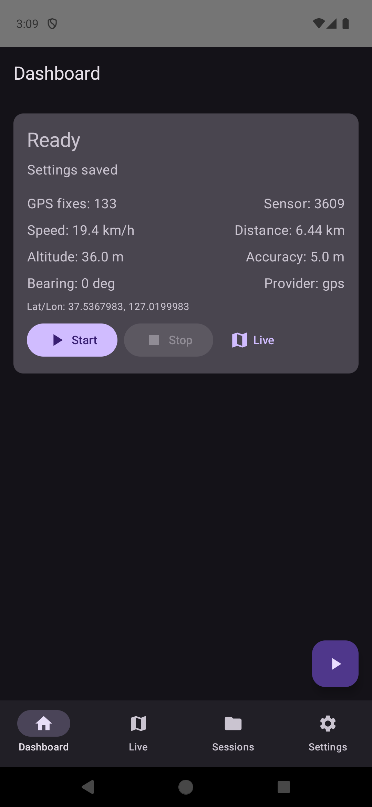
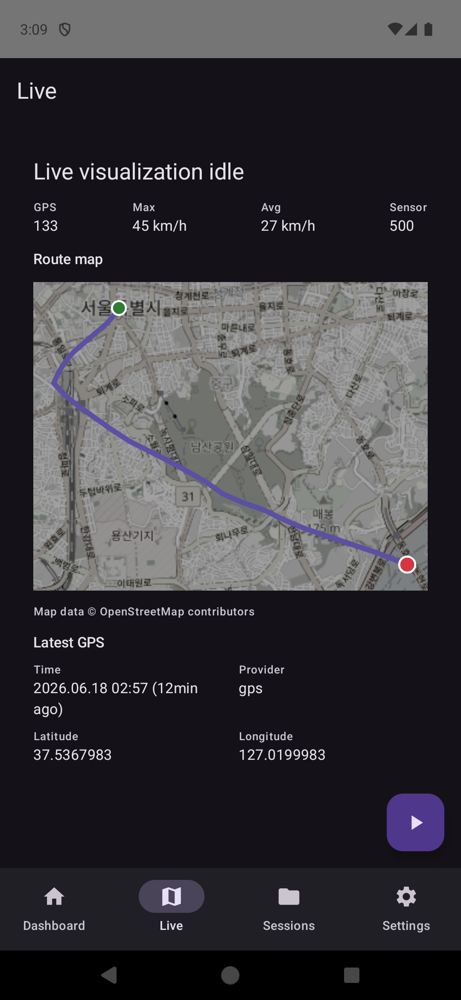
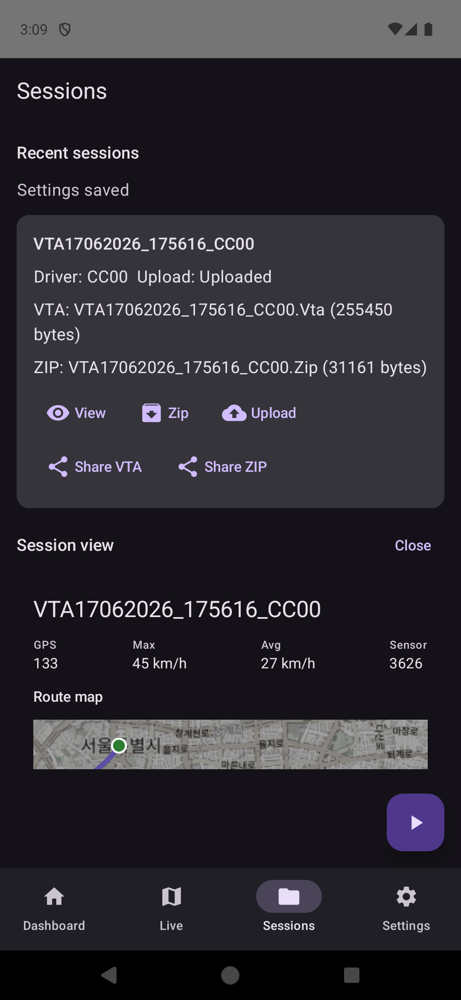
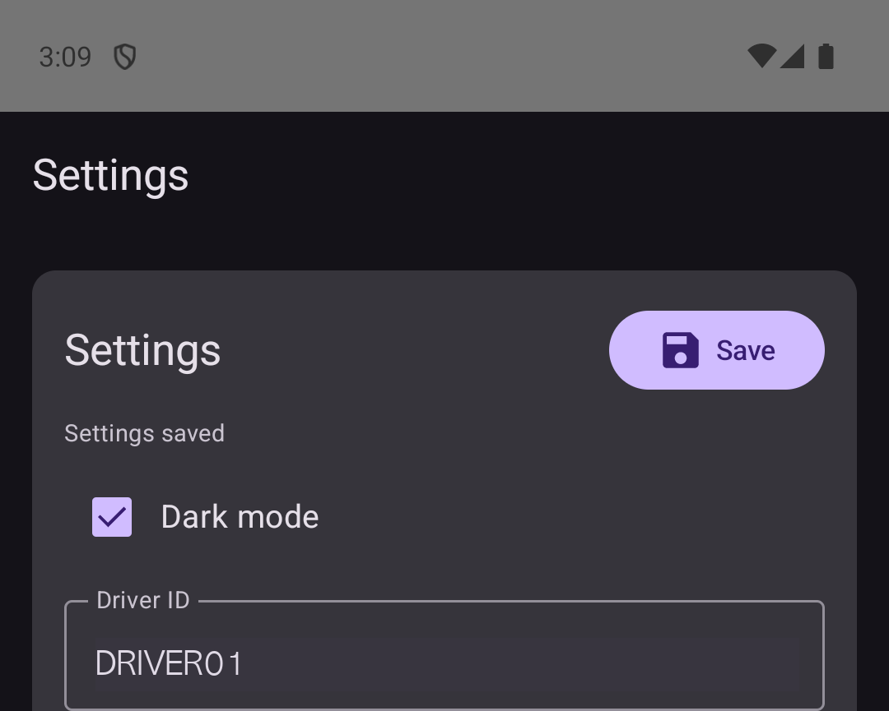

# VTA Logger Android

Kotlin/Jetpack Compose rewrite of the VTA Logger Android app. The app records GPS and phone sensor data, writes VTA-compatible session files, can compress sessions to ZIP, visualizes live and saved sessions, and optionally uploads ZIP files to a user-configured FTP server.

This repository is intended to become an open source Android project. It does not include signing keys, original APK reverse-engineering artifacts, generated release APKs, or user credentials.

## Screenshots

| Dashboard | Live Map |
| --- | --- |
|  |  |

| Sessions | Settings |
| --- | --- |
|  |  |

## Features

- Foreground GPS/sensor recording for Android 10+.
- VTA-style `.Vta` session files with legacy GPS/sensor record prefixes and extended metadata fields.
- Live map with current position, path trace, speed, altitude, accuracy, provider, and recent fixes.
- Saved session visualization from existing `.Vta` data.
- Session management with ZIP creation, Android sharesheet export, and optional FTP upload.
- FTP settings stored through encrypted Android storage. Credentials are user-supplied and are not hardcoded.
- GitHub Actions CI for build, unit tests, lint, and emulator-based instrumentation checks.

## Android Support

- `applicationId`: `com.temporal.vtalogger`
- `minSdk`: 29, Android 10
- `targetSdk`: 35
- Primary permissions: location, foreground service location, notifications on Android 13+, internet, network state, and wake lock.
- WorkManager/AndroidX may merge boot/network receiver permissions for upload retry scheduling. The app does not include a custom boot flow that starts recording automatically.
- Background location is not requested in v1. Recording is started by the user and runs through a foreground service notification.

## Build And Test

```bash
./gradlew testDebugUnitTest lintDebug assembleDebug
```

Connected emulator tests:

```bash
./gradlew connectedDebugAndroidTest
./scripts/emulator_verify.sh
```

Local FTP smoke test helper:

```bash
./scripts/local_ftp_upload_verify.sh
```

The FTP helper is for local verification only. Do not point tests at production servers.

## Release APK

Release signing material is intentionally excluded from this repository. Build release artifacts only with a private keystore stored outside git.

The locally produced delivery artifacts are kept under `output/apk/` and are ignored by git:

- `VTA-Logger-1.0.0-release.apk`
- `VTA_Logger_User_Guide.pdf`
- `Logger_jinwoo_v0.0.1.zip`

## Privacy And Security Notes

VTA sessions can contain precise location, speed, heading, altitude, device sensor values, timestamps, and driver/session identifiers. Treat exported `.Vta` and `.Zip` files as sensitive.

FTP is supported for compatibility, but plain FTP does not encrypt traffic. Prefer local export or a trusted private network unless a secure transport replacement such as FTPS/SFTP is added.

## Project Layout

- `app/src/main/java/com/temporal/vtalogger/recording/`: foreground recording service.
- `app/src/main/java/com/temporal/vtalogger/data/`: repositories and encrypted settings.
- `app/src/main/java/com/temporal/vtalogger/domain/`: VTA formatting, parsing, distance, filenames, ZIP helpers.
- `app/src/main/java/com/temporal/vtalogger/upload/`: FTP upload worker/client.
- `app/src/main/java/com/temporal/vtalogger/ui/`: Compose UI and visualization views.
- `.github/workflows/android-ci.yml`: CI build/test/lint and emulator verification.
- `docs/imu_gps_fusion_plan.md`: GPS 1 Hz limitation and IMU interpolation/fusion roadmap.
- `docs/release_signing.md`: release keystore and GitHub Actions secret strategy.

## Roadmap

- IMU-assisted interpolation for smoother live visualization between 1 Hz GPS fixes.
- Real-time ESKF/EKF fusion for short GPS gaps and low-latency path estimation.
- Offline smoothing for saved sessions.
- Optional map matching for road-only workflows.
- Secure transport support beyond plain FTP.

## License

License is not selected yet. This repository is currently private and prepared for a future open source release.
